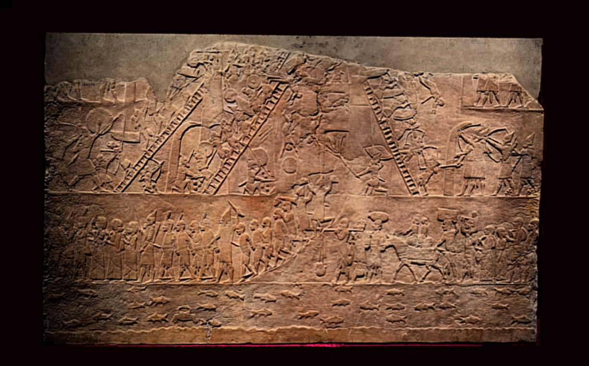

[](http://creativecommons.org/licenses/by-sa/4.0/) 
[](http://orcid.org/0000-0002-0246-2335)

# Nineveh North Palace, Room M Panel 17



This repository contains source data to recreate a 3D model from the British Museum's Assyrian galleries and currently on display in the Ahurbanipal exhibition.. The file structure is as follows:

```
ladders/
├── README.md
├── LICENSE.md
├── Images
├── Masks
├── Other
└── Models
   |-OBJ
   |-STL
   |-PLY
```
Models are included as PLY, OBJ and STL representations. 

# Metadata 

Gypsum wall panel relief: Assyrian capture of fortress in Egypt. At the top Assyrians storm the fortress; one tries to set fire to the gate while others undermine walls. Prisoners marched out are recognisable as Nubian soldier of Taharka, wear a single upright feather on their heads; native Egyptians are represented by a group of civilian prisoners with two children on a donkey. Below is a river containing many fish and some crabs. Dating to 645 BC - 635 BC

Length: 114.3 centimetres Width: 187.96 centimetres Depth: 15.24 centimetres

# LICENSE
The contents of this repository are licensed under CC-BY

# Credits

Photographs and models by Daniel Pett - 26 Huawei mobile phone. 
